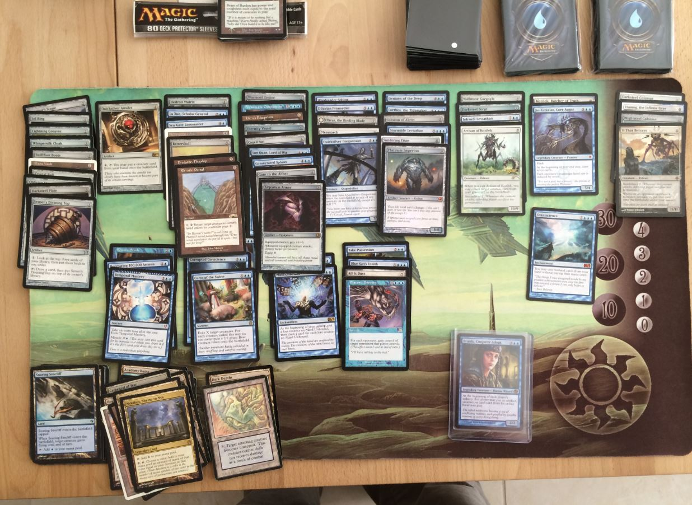
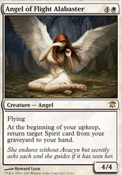
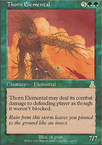
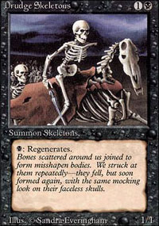
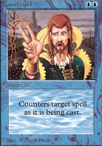
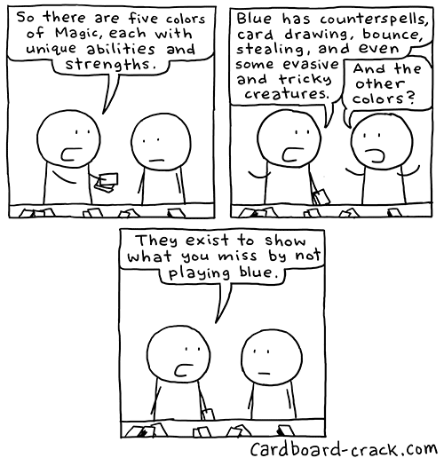
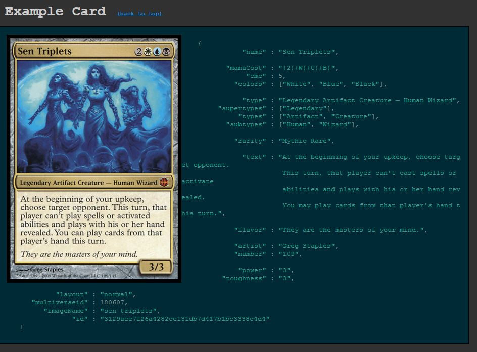

### Magic the Gathering Classification 

You may be familiar with magic the gathering. 

It's a strategy trading card game with many different cards. Players build decks with a set amount of cards. The cards he or she chooses determines the strategy. The diversity of cards printed over the last 20 years leads to a very diverse playing environment, and makes selecting the best cards for your deck difficult. 

In this project I seek to classify cards by their text/abilities. As a player I know that the five colors represent five overarching strategies. Each color has unique keyword abilities. I will use logistic regression then machine learning to attempt to classify the cards based solely on text. 

Perfect accuracy is unachievable without overfitting. Every now and then a card gets printed that pushes the boundaries of what that color is allowed to do. Looking at the inevitable residuals should be very interesting.  

Goals are twofold:
   - Compare various machine learning methods. 
   - Identify residuals and see if they fit a pattern. 

Magic is broken up into 5 colors, each with different attributes.

Color theory (about which colors get which abilities) gets really advanced

http://mtgsalvation.gamepedia.com/Color_Pie

I found a complete database of every card ever made:

http://mtgjson.com/

Cards are in JSON format

Humans can very easily sort cards by color without knowing what color they are, each color has its own strategies and tropes.  Lets see how well a computer can classify them.  